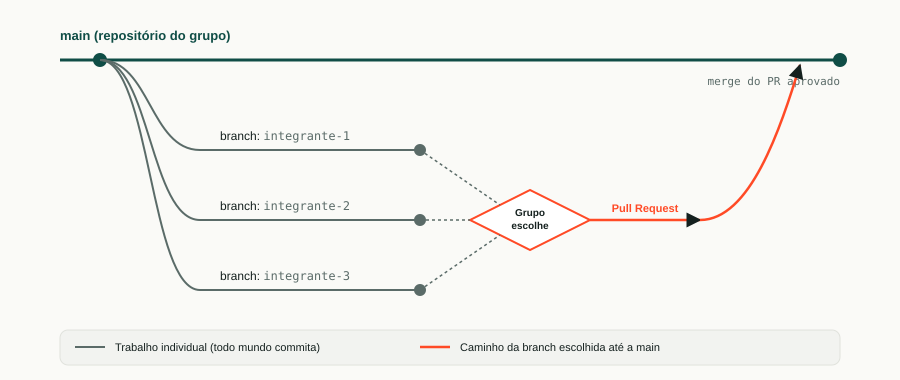

# Guia de Acesso SSH, Branches e Pull Requests

**Para usar na abertura e como referência durante todo o Bloco 3**

Este guia ensina o fluxo de trabalho que os grupos vão usar em **todos os encontros de React**: acesso ao GitHub por chave SSH, cada integrante trabalhando na própria branch, o grupo escolhendo qual versão vira a oficial do dia, e essa versão entrando na `main` por Pull Request.

---

## Parte 1 — Por que branch, e não todo mundo direto na `main`

Se todo mundo commitar direto na `main`, o código de um sobrescreve o do outro e ninguém sabe mais quem fez o quê. **Branch** é uma cópia paralela do projeto — cada um mexe na própria sem atrapalhar os colegas. No fim, o grupo escolhe uma branch para trazer de volta.



Três branches individuais nascem da `main`, o grupo escolhe uma, e só ela volta por **Pull Request**.

### O que é um Pull Request (PR)

É um **pedido formal** para trazer o código de uma branch para a `main` — com uma tela de revisão antes de confirmar. É assim que equipes de verdade trabalham: ninguém entra código na versão principal sem alguém olhar antes. No caso de vocês, "alguém olhar" é o próprio grupo decidindo junto.

### O que fica registrado

Depois de hoje, o histórico do repositório mostra exatamente quem commitou o quê, em qual branch, em qual dia. Isso não é para vigiar — é para que ao final do semestre cada um consiga apontar, com prova, o que construiu.

---

## Parte 2 — Configurando acesso SSH ao GitHub

**Fazer uma vez só**, no primeiro computador que cada um usar neste bloco. Se o mesmo computador for usado em todos os encontros pela mesma pessoa, a configuração fica salva e não precisa repetir.

> ⚠️ **Computador compartilhado com outras turmas?** Antes de gerar uma chave nova, rodem o comando abaixo para ver se já existe uma chave configurada (de vocês mesmos, de uma aula anterior, ou de outra pessoa):
>
> ```bash
> ls -al ~/.ssh
> ```
>
> Se aparecer um arquivo `id_ed25519` que **não é seu**, não sobrescrevam. Sigam o Passo 1 usando um nome de arquivo próprio, como mostrado abaixo.

### Passo 1 — Gerar a chave SSH

```bash
ssh-keygen -t ed25519 -C "seu-email@exemplo.com"
```

O terminal vai perguntar onde salvar o arquivo. Apertem **Enter** para aceitar o local padrão — **a menos que já exista uma chave de outra pessoa**, caso em que vocês digitam um nome próprio, por exemplo:

```
Enter file in which to save the key: /home/aluno/.ssh/id_ed25519_seu-nome
```

Em seguida ele pergunta por uma senha (_passphrase_). Podem deixar em branco (Enter duas vezes) para simplificar, ou definir uma senha se preferirem mais segurança.

### Passo 2 — Ativar o agente SSH e adicionar a chave

```bash
eval "$(ssh-agent -s)"
ssh-add ~/.ssh/id_ed25519
```

> Se vocês usaram um nome de arquivo diferente no Passo 1, troquem `id_ed25519` pelo nome escolhido em **todos** os comandos daqui em diante.

### Passo 3 — Copiar a chave pública

```bash
cat ~/.ssh/id_ed25519.pub
```

Isso imprime uma linha longa começando com `ssh-ed25519 AAAA...`. Selecionem e copiem a linha inteira.

### Passo 4 — Cadastrar a chave no GitHub

1. No GitHub, cliquem na sua foto de perfil → **Settings**.
2. No menu lateral, **SSH and GPG keys**.
3. **New SSH key**.
4. Em **Title**, escrevam algo identificável, como `Laboratório SENAI - <seu nome>`.
5. Em **Key**, colem a linha copiada no Passo 3.
6. **Add SSH key**.

### Passo 5 — Testar a conexão

```bash
ssh -T git@github.com
```

Na primeira vez, ele pergunta se confiam na conexão — digitem `yes`. Se aparecer uma mensagem começando com `Hi <seu usuário do GitHub>! You've successfully authenticated`, está funcionando.

---

## Parte 3 — Passo a passo do dia a dia (branches e Pull Request)

### Antes de começar (só no primeiro dia do bloco, 25/08)

Um integrante do grupo cria o repositório do front-end no GitHub (vazio, sem arquivos ainda) e adiciona os colegas como colaboradores. Nome sugerido: `<nome-do-grupo>-frontend`.

Todos os integrantes então clonam **usando a URL SSH** (começa com `git@github.com:`, não com `https://`):

```bash
git clone git@github.com:<usuario>/<nome-do-repositorio>.git
cd <nome-do-repositorio>
```

> A URL SSH aparece no GitHub clicando em **Code** → aba **SSH** (não a aba HTTPS).

### Identificação nos commits

Antes do primeiro commit, configurem seu nome e e-mail **dentro do repositório** (não no computador inteiro — é importante em máquina compartilhada):

```bash
git config user.name "Seu Nome"
git config user.email "seu-email@exemplo.com"
```

Sem isso, os commits podem aparecer com o nome de outra pessoa que usou o mesmo computador antes — e o histórico deixa de servir como prova do que cada um fez.

### Passo 1 — Atualizar a `main` local

No início de **cada** encontro, antes de criar sua branch do dia:

```bash
git checkout main
git pull origin main
```

Isso garante que você está partindo da versão mais recente — a que o grupo escolheu no encontro anterior.

### Passo 2 — Criar sua branch do dia

```bash
git checkout -b <seu-nome>-<data>
```

Exemplo: `git checkout -b joao-25-08`

> Uma branch por pessoa, por encontro. Isso evita branch antiga de duas semanas atrás confundindo o histórico.

### Passo 3 — Trabalhar e commitar

Trabalhe normalmente. Ao terminar (ou em pontos de checkpoint que o professor indicar):

```bash
git add .
git commit -m "descrição curta do que foi feito"
```

### Passo 4 — Subir sua branch

```bash
git push origin <seu-nome>-<data>
```

Agora sua versão está no GitHub, visível para o grupo e para o professor — mesmo que não seja a escolhida.

### Passo 5 — O grupo escolhe

Nos últimos 15–20 minutos da aula, o grupo compara as versões (rodando cada uma, ou só conversando sobre as decisões de cada um) e escolhe **uma** para seguir.

### Passo 6 — Pull Request da branch escolhida

Quem tem a branch escolhida abre o Pull Request no GitHub:

1. No repositório, aba **Pull requests** → **New pull request**.
2. Base: `main` ← Compare: `<branch-escolhida>`.
3. Título curto descrevendo o que foi feito.
4. **Create pull request.**

O grupo revisa junto (2 minutos bastam) e clica em **Merge pull request**.

### Passo 7 — Todo mundo atualiza

Antes de sair, todos os integrantes — inclusive quem não foi escolhido — rodam:

```bash
git checkout main
git pull origin main
```

Assim, no próximo encontro, todo mundo parte exatamente do mesmo ponto.

---

## Cola rápida (imprimir ou deixar fixado)

```bash
# configuração SSH — uma vez só
ssh-keygen -t ed25519 -C "seu-email@exemplo.com"
eval "$(ssh-agent -s)"
ssh-add ~/.ssh/id_ed25519
cat ~/.ssh/id_ed25519.pub      # copiar e cadastrar no GitHub
ssh -T git@github.com          # testar

# início de cada aula
git checkout main
git pull origin main
git checkout -b seu-nome-data

# durante a aula
git add .
git commit -m "mensagem"
git push origin seu-nome-data

# depois que o grupo escolher a branch (só quem foi escolhido faz o PR)
# → abrir Pull Request no site do GitHub, base: main

# todo mundo, no fim da aula
git checkout main
git pull origin main
```

---

## Erros comuns e como resolver

| Situação                                                  | O que fazer                                                                                                                                                                     |
| --------------------------------------------------------- | ------------------------------------------------------------------------------------------------------------------------------------------------------------------------------- |
| `Permission denied (publickey)` ao dar `push` ou `pull`   | A chave não foi cadastrada no GitHub, ou o agente SSH não está ativo. Repitam o Passo 2 e o Passo 5 da Parte 2.                                                                 |
| `git clone` pede usuário e senha                          | Vocês usaram a URL HTTPS por engano. Confiram se copiaram a URL da aba **SSH** no GitHub (começa com `git@github.com:`).                                                        |
| Chave de outro colega já existe no computador             | Não sobrescrevam. Gerem a sua com nome de arquivo próprio (ver aviso no início da Parte 2) e usem esse nome em todos os comandos SSH.                                           |
| Commit aparece com o nome de outra pessoa                 | Rodem `git config user.name` e `git config user.email` **dentro da pasta do repositório**, sem `--global`, e refaçam o commit.                                                  |
| Dois integrantes usaram o mesmo nome de branch por engano | Sem problema, branch é local até o `push` — renomeie com `git branch -m novo-nome` antes de subir.                                                                              |
| PR mostra conflito ("This branch has conflicts")          | Normalmente porque a `main` mudou depois que a branch foi criada — nesses casos, chamem o professor; resolver conflito é conteúdo futuro, não precisam resolver sozinhos ainda. |

---

## O que NÃO fazer

- Não commitar direto na `main`.
- Não deixar a branch do dia "aberta" para o próximo encontro — cada dia começa com uma branch nova, a partir da `main` atualizada.
- Não apagar as branches não escolhidas — elas ficam no histórico como prova do trabalho individual de cada um.
- Não usar `--global` ao configurar `user.name`/`user.email` em computador compartilhado.
